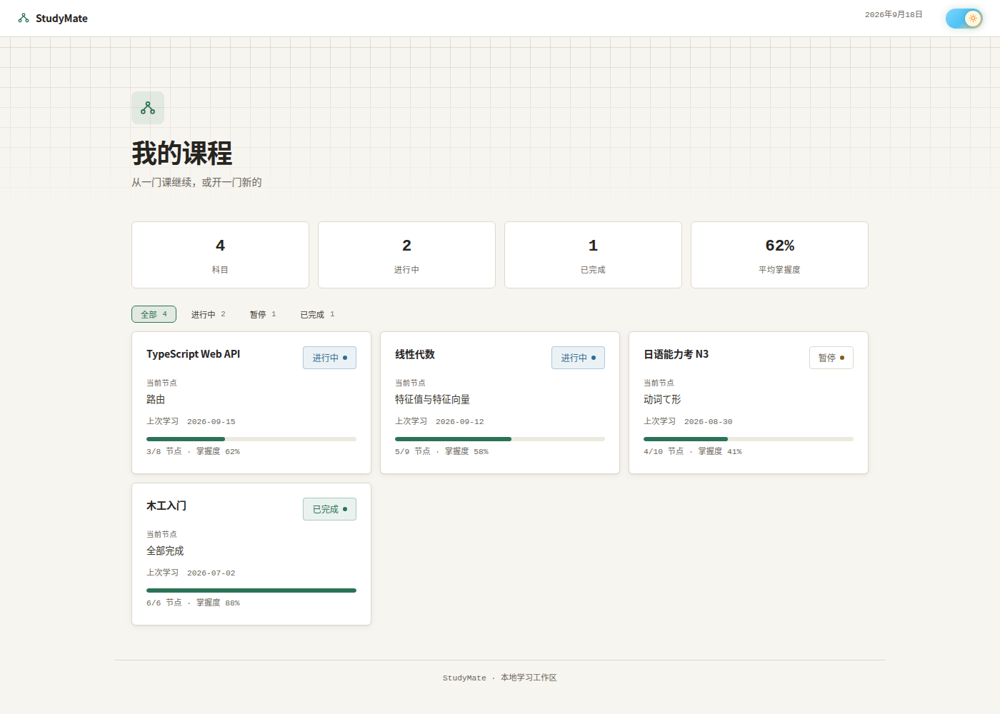
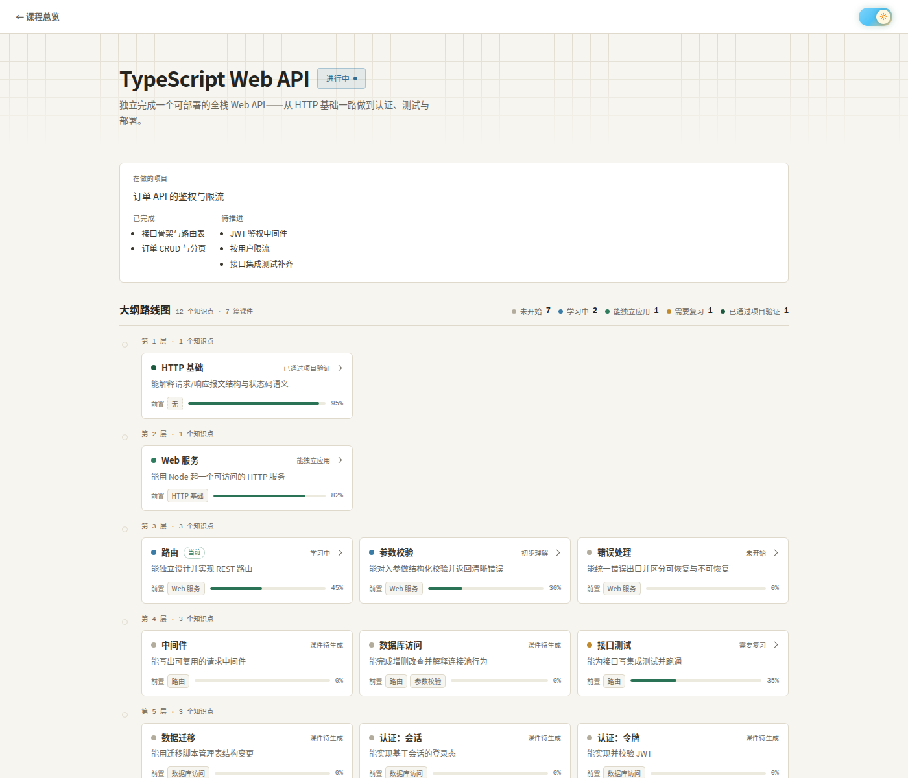
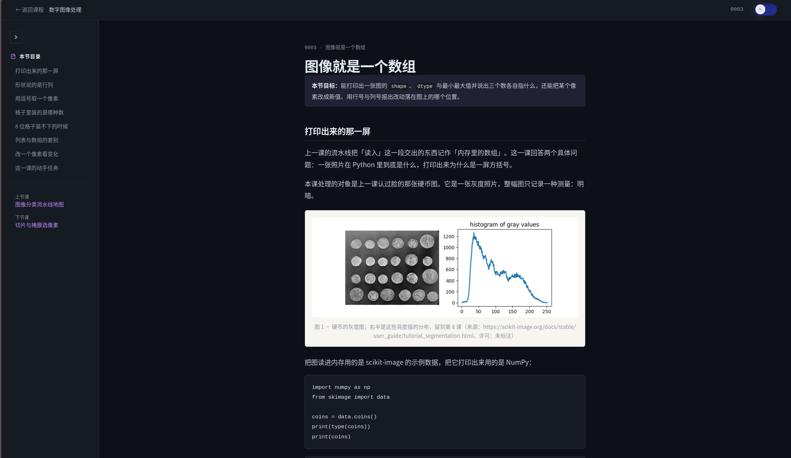

<p align="center"></p>

<h1 align="center">StudyMate</h1>

<p align="center"><b>给要长期自学的人：让「跟 AI 聊一次」变成一门有进度、有课件、有验收的课。</b></p>

<p align="center">


</p>

<p align="center"><sub>DSH = DeepSeek Harness 智能体运行时；StudyMate 是它的一个「学习模式」预设加一套技能。</sub></p>

<p align="center"><a href="#快速开始">快速开始</a> · <a href="#它是什么">它是什么</a> · <a href="#核心功能">核心功能</a> · <a href="#常见问题">常见问题</a> · <a href="docs/使用说明.md">使用说明</a></p>

<table align="center">
<tr>
<td></td>
<td></td>
</tr>
</table>

## 快速开始

**前置条件**：

- **DSH（DeepSeek Harness）**，且 `dsh` 命令可用——本系统是它的一个预设加一套技能，没有 DSH 跑不起来（开发时用的构建：`0.1.5-rc.1`）
- **Python 3.9+ 与 pyyaml**：`pip install pyyaml`——主页生成与课件检查都要它
- **bash + coreutils**（`install.sh` 用 `cp` / `mkdir` / `sed`）；其它平台请对照脚本自己做

`install.sh` 自己不做依赖检查，缺东西会在中途硬失败。DSH 本身的安装不在本项目范围内，按 DSH 的安装说明装好再回来。

```bash
# ① 拿到引擎项目（换 SSH：git clone git@github.com:Miaotofu01/Study-Mate.git StudyMate）
git clone https://github.com/Miaotofu01/Study-Mate.git StudyMate && cd StudyMate
# ② 装「学习模式」预设 + 建学习工作区（幂等，可重复跑）
./install.sh
# ③ 起 DSH，在任意目录新建会话并选「学习模式」预设
dsh web
```

跑对了会看到（路径随机器不同）：

```text
① 预设 → /home/you/.dsh/.agent-presets/learning（skill 目录：/path/to/StudyMate/.dsh/skills）
② 学习工作区 → /path/to/StudyMate/workspace（配置在 /home/you/.dsh/studymate-config.yaml）
完成。现在可在任意目录开会话，选'学习模式'预设开始学习。
```

**第一次学习**：新建会话时选「学习模式」，说一句「我想学 X」。首次使用只问三件事——想学什么、现在的基础、讲法偏好；然后进入开课盘问（学它的目的、想学到什么程度、配什么项目练习、实验用什么方式），问清才建课。

学完一门课的入口在根主页 `<workspace>/index.html`：它是生成产物，第一次会话之后才有；想手动生成跑 `python3 scripts/gen_home.py`。

<details>
<summary><b><code>install.sh</code> 具体做了什么 / 换工作区位置</b></summary>

它做两件事：把 `preset/learning/` 装到 `~/.dsh/.agent-presets/learning/`，并让预设里的技能目录固定指向本项目的 `.dsh/skills/`；建学习工作区（默认本项目的 `workspace/`）并把它的路径写进 `~/.dsh/studymate-config.yaml`。

换工作区位置：改 `~/.dsh/studymate-config.yaml` 里的 `workspace:`，或跑一次 `LEARN_WORKSPACE=<新路径> ./install.sh`；项目被移动过也要重跑一次（配置里的 `root` 会按当前位置重写）。学习数据都在工作区里，换机器把整个项目（含 `workspace/`）拷走再跑一次 `./install.sh`。

</details>

## 它是什么

StudyMate 是 DSH（DeepSeek Harness）的**「学习模式」预设**加一套技能。你只跟一个人对话——**主教练**（`learning-system` 总控，会话的调度中枢，也是唯一能问你问题的角色）；它背后按需调度收集资料、采图、课程设计、讲解、练习评估五个子角色，你不需要知道它们的分工。

- **长期陪读，会话不背历史**：同时带多门科目，每门一份大纲——知识点按前置依赖排成路线图，每个知识点标课的类型（只讲解的概念课 / 讲练结合的实操课 / 验收阶段成果的实验课）与过关标准。学习进度落在文件里，每次开场只恢复「当前学到哪」。
- **一份跨科目共享记忆**：记住你的现有水平、哪种讲法有效、常见卡点，下一门课不用重新自我介绍。
- **讲解写在课件文件里**：每个知识点一节课，页面是自包含 HTML（浏览器直接打开），源文件是同一份 `.md` 内容 + `.quiz.json` 题目（实验课的说明页不出题，只有 `.md`），由 `scripts/render_lesson.py` 渲染成页面——改课件、改题都改源文件再重渲。能回看，页内练习当场判分；读不懂就把那段原文贴回会话问。
- **练习有 lab**：实操课与实验课另配一份 lab，也就是引导式实操材料（分步带做，关键步骤留白给你亲手写），写完跑一次就能验证。
- **过关看可运行证据**：核验时逐条对**过关标准**（大纲里每个知识点的过关标准），练习按**四层**排难度——L1 理解 → L2 改造 → L3 排错 → L4 应用（L4 = 放进你自己的项目）。

首版面向编程与软件工程类科目。不做多用户/社交/排行榜，不做在线代码编辑器（用本地文件和终端），不自动生成全部课程内容——更多边界见 [设计方案](docs/设计方案.md)。

## 为什么用它

> 下表按本项目的设计原则整理，**不是**对比评测 —— 本项目没有跟任何产品做过评测。

| 常见做法 | 卡在哪 | StudyMate 的做法 |
|---|---|---|
| 直接跟 AI 聊天学 | 会话一长上下文就吃不下；聊完不留痕，下次从零开始 | 状态全部落盘，会话只带当前进度；讲解写进课件文件 |
| 看视频课 / 网课 | 有体系但进度不由你控，没人验收你真会了 | 大纲可动态调整；每课有过关标准，过关要可运行证据 |
| Anki / 错题本 | 管记忆很好，不管「学会一门课」这件事 | 用检索·间隔·交错设计练习，组织单位是课程与项目 |

## 核心功能

**课程总览与大纲路线图**（见第一屏那两张）：总览页列全部科目与当前节点，点进去是那门课的知识点路线图，按依赖分层排开、按状态着色，点节点原地展开课件子卡片。

**课件是学习的主载体**：真实场景开场、页内练习当场判分、侧栏是目录与上/下节课入口，亮/暗主题开关长在课件自己身上（地址栏加 `?theme=dark` 也能看）。



> 第一屏的总览页与科目页由 `python3 scripts/preview_templates.py` 用脚本内置的假数据渲染，只展示页面长什么样——真实工作区里是**你的**科目与进度；这张课件页是**真实产物**。跑那条命令加 `--open` 就能自己看。
>
> **还缺一张图**：DSH 里跟主教练对话的实拍。拿法：`dsh web` → 选「学习模式」→ 走一遍开课盘问，或贴一段看不懂的课文提问 → 截「你的提问 + 答复 + 末尾那行 `**下一步**：…`」这一屏，存 `docs/images/dsh-session.png`，插在本文「第一次学习」一段后面。

## 用法示例

- **「我想学 C++ 打竞赛」** → 先盘问目的/程度/项目/实验方式，再产出大纲路线图与科目主页，开第一课。
- **贴一段看不懂的课文 + 「这里没懂」** → 主教练当场答一小段，记一条档案，送你回原位接着读。
- **「考考我」** → 现场出题 + 按可运行证据核验，给一份评估记录并更新进度。
- **「太简单了 / 没听懂」** → 换讲法（加边界与反例，或降一层抽象），并把这条偏好记进共享记忆。

## 配置与维护

<details>
<summary><b>脚本：主页生成 + 课件渲染 + 四道校验</b></summary>

```bash
python3 scripts/gen_home.py                    # 生成根主页 + 全部科目主页（默认读配置里的 workspace）
python3 scripts/preview_templates.py --open    # 用假数据渲染主页模板到 .preview/，只看样式与交互
python3 scripts/render_lesson.py <subject_path> <节点id>   # 内容文件 + 题库 → 课件 HTML（--check 只校验不写盘）
python3 scripts/check_curriculum.py examples/.learning/subjects/typescript-web-api/curriculum.yaml
python3 scripts/check_lesson.py workspace/.learning/subjects/cpp-competitive-programming/lessons/0001-hello.first.html --subject workspace/.learning/subjects/cpp-competitive-programming --node hello.first
python3 scripts/check_pool.py <你的科目目录>    # 图片池：索引 pool.md 与 assets/img/pool/ 对不对得上
python3 scripts/check_skill.py .dsh/skills/*    # 技能 frontmatter（改过技能就跑一次）
bash scripts/tests/run_tests.sh                # 回归测试：检查/题目属性/命名指针/提示词规则/DOM（改引擎就跑一次）

# 换成你自己的科目：--subject 给科目目录，--node 给该课件对应的节点 id；大纲校验可一次传多个 curriculum.yaml
```

`check_lesson.py` 只阻断工程与结构缺项（文件名与编号、课件归属、共享层引用、题目结构与属性写法、题目位置标记残留、主题开关；`kind` 为 `实操/实验` 时还要求 lab 与产物齐全），内容风格类问题只提示；其中「题目位置标记残留」只可能来自手写时代的老课件——渲染产物里不会有标记。`check_pool.py` 校验图片池：索引表头七列、文件名合规、来源 URL 与许可非空、单张 ≤300 KB——还没建过图片池的科目没有 `assets/img/pool.md`，它会报一行「索引不存在」并退出 1，那是图片库还没建，不是命令坏了。退出码：`check_lesson.py` / `check_curriculum.py` / `check_pool.py` 有阻断项即 1，`gen_home.py` 占位符缺失或产物断链即 1。

`scripts/tests/run_tests.sh` 不需要浏览器（`--browser` 才加真实 Chrome 的高亮那套）；测试自己造临时科目，不碰 `workspace/`。改了检查、`templates/assets/` 或 `.dsh/skills/` 之后跑一次，见 `scripts/tests/README.md`。

</details>

## 项目结构

```text
StudyMate/                     ← 本仓库：系统源码（引擎），学习时只读
├── install.sh                 # 装预设 + 建学习工作区，幂等
├── .dsh/skills/               # 11 个技能：总控 learning-system + 5 个角色 + 5 个规范
│   ├── learning-system/       #   总控（主教练）：开场、盘问、调度、档案
│   ├── resource-scout/        #   角色：收集资料（权威教材与官方文档 → 资源清单）
│   ├── image-scout/           #   角色：采图（抓网页现成的图 → 科目图片库与索引）
│   ├── curriculum-designer/   #   角色：课程设计（大纲 / 实验课节点）
│   ├── learning-coach/        #   角色：讲解（写课件内容）
│   ├── practice-evaluator/    #   角色：出题与评估（题目唯一 owner）
│   ├── lesson-design/         #   规范：课件唯一约束来源
│   ├── layered-practice/      #   规范：四层练习与题型
│   ├── evidence-check/        #   规范：完成证据核验
│   ├── local-qa/              #   规范：局部提问怎么答
│   └── record-keeping/        #   规范：学习状态读写规则
├── preset/learning/           # 「学习模式」预设源（install.sh 装到 ~/.dsh/）
├── schemas/                   # 5 份数据结构：大纲 / 进度 / 评估 / 会话摘要 / 科目
├── templates/                 # 页面骨架（主页、科目页、课件壳）与前端资源 assets/
├── scripts/                   # 主页生成 + 课件渲染器 + 四道校验检查（用法见上）+ tests/ 回归测试
├── examples/                  # 示例学习工作区：两门示例科目，可拿来跑生成器看效果
├── docs/                      # 使用说明、课件内容格式、设计方案、实施计划、docs/images/ 截图
└── workspace/                 # 你的学习数据（默认位置，可配置；也被 .gitignore 忽略）
```

仓库之外还有一处安装落点：`~/.dsh/.agent-presets/learning/`（预设）与 `~/.dsh/studymate-config.yaml`（工作区定位），都由 `install.sh` 写入。

学习工作区里面长什么样（科目文件夹、课件、lab、档案、课型与题型、模板与生成器的契约），见 [使用说明 §六](docs/使用说明.md#六学习数据存在哪)。

## 常见问题

<details>
<summary><b>装完没有主页 / 直接打开 <code>templates/</code> 里的 HTML 没样式</b></summary>

主页要从学习数据生成：跑 `python3 scripts/gen_home.py` 再看 `<workspace>/index.html`（还没科目时是空状态页）。`templates/*.html` 引用的是生成后的工作区相对路径，单独打开只有裸 HTML，这是设计如此。
</details>

<details>
<summary><b>报 <code>ModuleNotFoundError: No module named 'yaml'</code></b></summary>

`pip install pyyaml` 即可：主页生成与课件检查都要它。注意依赖缺了检查会**变松**——没有 `pyyaml` 时 `check_lesson.py` 跳过「这课该不该有 lab」的判定（只 `WARN`）；没有 `jsonschema` 时 `check_curriculum.py` 跳过 schema 校验，只报重复 id、悬空引用与环。
</details>

更多问题（手改 YAML 的坑、大纲改节点后指针为什么会错、能不能离线）见 [使用说明 §八 常见问题](docs/使用说明.md#八常见问题)。

## 贡献 / 路线图 / License

- **仓库状态**：本仓库 **MIT 许可**（见 `LICENSE`，版权 Cattofu）；徽章只用真实可核实的值（预设形态、Python 版本、许可证），没有 star / 构建状态 / 下载量这类还不足据可填的徽章。
- **文档**：[使用说明](docs/使用说明.md)（日常怎么用、课型与题型、检查与档案规则）· [课件内容格式](docs/课件内容格式.md)（内容文件与题目位置的语法）· [设计方案](docs/设计方案.md)（产品视角）· [实施计划](docs/实施计划.md)（历史任务清单）· [模板说明](templates/README.md) · [前端资源契约](templates/assets/README.md)
- **改之前先跑**：`python3 scripts/check_skill.py .dsh/skills/*`，以及上面对应那一条大纲 / 课件校验命令。
- **当前口径（已知限制）**：一个知识点对应一节课件；大纲里插入或删除节点，已产出课件的上/下节课指针会指错（新课件重跑渲染器即按新邻居重算，手写的老课件人工改一次；检查都会报出来）；调试期移除的样板课件待重做。遗留项见 [实施计划](docs/实施计划.md) 文末。
